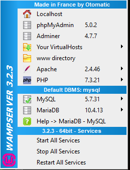
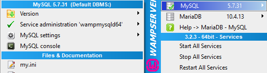
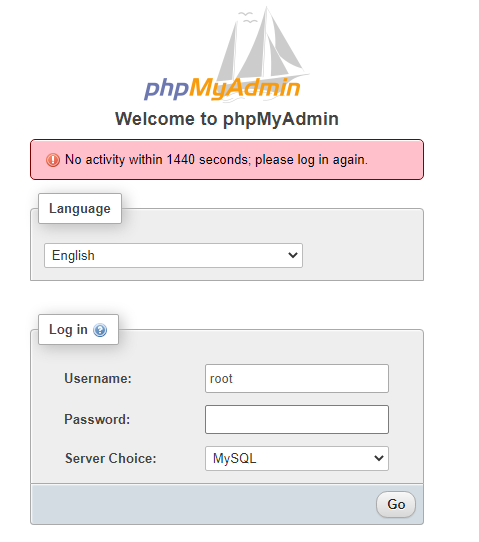
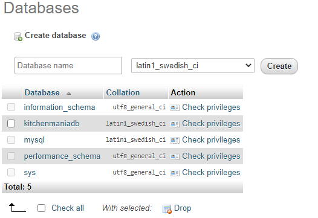
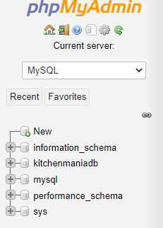
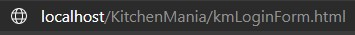
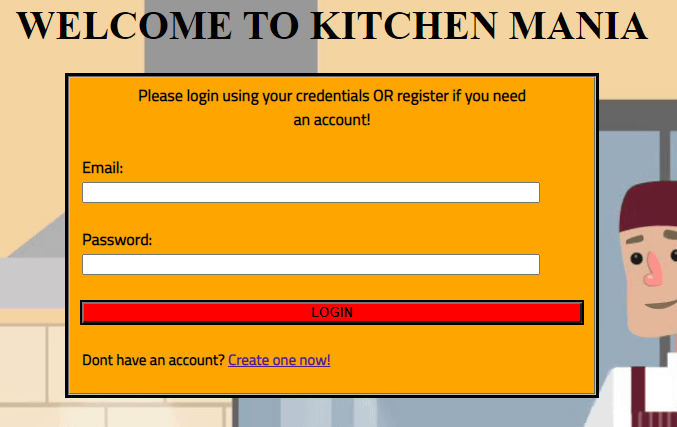
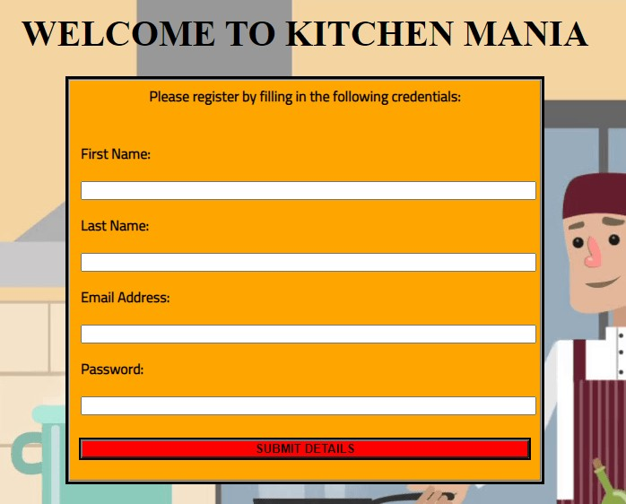
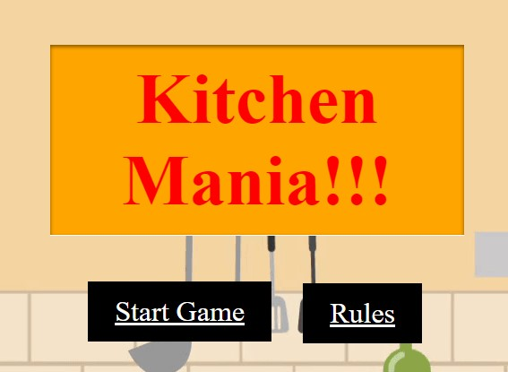

# Kitchen Mania - Start-up Instructions

In order to run Kitchen Mania, please follow the steps provided to make sure that you are correctly running the web application!

**PLEASE MAKE SURE TO INSTALL WAMP AHEAD OF TIME, AS YOU WILL NEED IT TO ACCESS THE DATABASE THAT WILL STORE THE LOGIN INFORMATION AND ALLOW USER SIGN-UPS**

### Step 1

> After correctly configuring your WAMP server, make sure you have access to phpMyAdmin (Can be accessed by single right click on the WAMP server icon located at the bottom left on your taskbar)

### Step 2

> The following steps can all be done on the MYSQL database (also accessed the same way, except you would click on the MySQL dragdown menu and select MySQL Console.) but we will be giving the steps for creating the database through phpMyAdmin and 
> creating the table that will hold the required details through MySQL console. 

### Step 3

> You will now be prompted with a login screen to access phpMyAdmin - please use the default username: **root** and the default password is nothing, so after entering the username just hit the **go** button and continue.

### Step 4

> On the left hand side, you will see some databases that already exist, as well as a section Called New - please click that and create a new database named "**kitchenmaniadb**".

### Step 5

> Once it has been created, please open up the MySQL console and create the following tables using the following code: 

> CREATE TABLE km_users (
     ID INT UNSIGNED AUTO_INCREMENT PRIMARY KEY,
     FirstName VARCHAR(100),
     LastName VARCHAR(100),
     EmailAddress VARCHAR(200),
     Password VARCHAR(50)
);

### Step 6

> Now that the database is set and ready to be used, you will be able to begin running the web application. 

> Open up the file within the **[Code](/Code/KitchenMania)** Folder named: **kmLoginForm.html**

> This step can be done from opening up your localhost after placing the project files within **C:\wamp64\www**. That would require you to go to your browser and type in the following: **localhost/KitchenMania/kmLoginForm.html**

### Step 7

> After opening up from the localhost, you will be able to proceed with either logging in OR signing up with a new account to begin playing.

> Since this your first initial setup, please click on **create an account now** and follow the steps to create the account, once completed, login with those credentials.

### Step 8

> Before finally getting access to the web application, you will be prompted to click on a URL provided after a successful login.

### Step 9

> Now you're ready to play Kitchen Mania! Enjoy and please leave any feedbacks or concerns you have.

